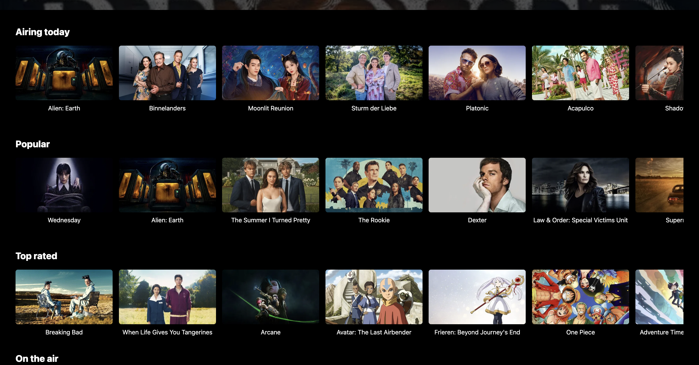
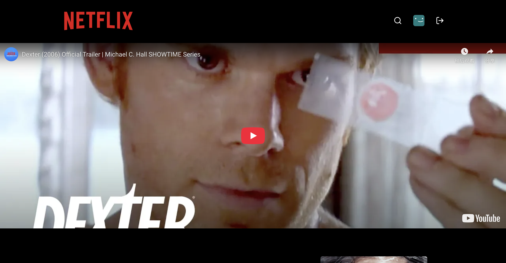
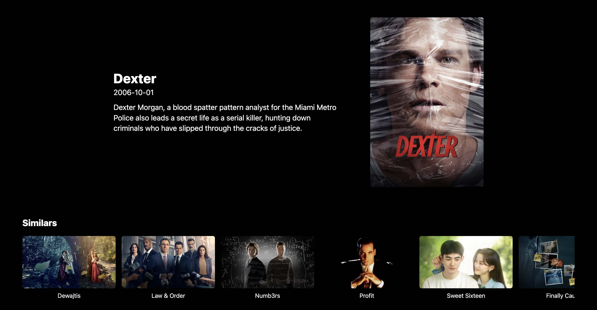
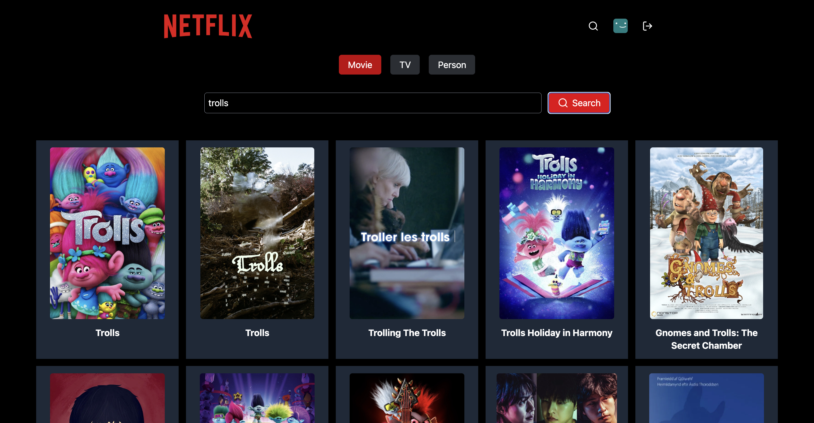

<div align="center" id="top"> 
  

  &#xa0;

  <!-- <a href="https://react_3_netflix.netlify.app">Demo</a> -->
</div>

<h1 align="center">Netflix VIdeo Platform Replication</h1>

<p align="center">
  

  

  

  

</p>


<hr> -->

<p align="center">
  <a href="#dart-about">About</a> &#xa0; | &#xa0; 
  <a href="#sparkles-features">Features</a> &#xa0; | &#xa0;
  <a href="#rocket-technologies">Technologies</a> &#xa0; | &#xa0;
  <a href="#white_check_mark-requirements">Requirements</a> &#xa0; | &#xa0;
  <a href="#checkered_flag-starting">Starting</a> &#xa0; | &#xa0;
  <!-- <a href="#memo-license">License</a> &#xa0; | &#xa0; -->
  <a href="https://github.com/acse-mz223" target="_blank">Author</a>
</p>

<br>

## :dart: About ##

This project is a replica of the Netflix video platform, developed to demonstrate proficiency in full-stack web development and provide a real-world simulation of how a streaming service works. The platform is built using `Vite`, `Express.js`, `React`, and other modern web technologies, providing a seamless experience for users to browse, search, and watch videos.

[🔗 Live Demo (may take a minute to load the first time)](https://react-3-netflix.onrender.com)

---

## :sparkles: Features ##

- ✅ **User Authentication** – Implemented user registration, login, and secure session management using `JWT` and `bcrypt.js` for password encryption.  
- ✅ **Video Display & Search** – Integrated with `TMDB API` to fetch and display trending movies, categories, and trailers. The platform allows users to search and view detailed movie information.  
- ✅ **Responsive Interactive UI** – Designed with `Tailwind CSS` for a responsive, user-friendly layout, optimized for both desktop and mobile devices.  
- ✅ **HD Video Playback** – Incorporated `React Player` for smooth and high-definition video playback.  
- ✅ **Serverless Deployment** – Deployed on `Render` with a serverless architecture to ensure scalability, high availability, and quick load times.  

---

## :page_facing_up: Pages Overview ##
### **Homepage**  
Displays trending movies, categories, and personalized recommendations for users.  
  
  
  

### **Login / Signup**  
Handles user authentication with secure login and registration.  
  

### **Media Detail Page**  
Shows detailed information about a selected movie or series, including description, cast, and trailers.  
  
  

### **Search Page**  
Allows users to search for movies or tvs by title or keyword and view detailed results.  
  


---

## :rocket: Technologies ##

The following tools were used in this project:

- [Vite] [https://vitejs.dev/]
- [Express.js] [https://expressjs.com/]
- [React] [https://reactjs.org/]
- [Tailwind CSS] [https://tailwindcss.com/]
- [Axios] [https://axios-http.com/]
- [MongoDB] [https://www.mongodb.com/]
- [JWT] [https://jwt.io/]
- [bcrypt.js] [https://www.npmjs.com/package/bcryptjs]
- [Render] [https://render.com/]
- [TMDB API] [https://www.themoviedb.org/]
- [React Player] [https://github.com/CookPete/react-player]
- [Neon] [https://neon.tech/]

---

## :white_check_mark: Requirements ##

Before starting :checkered_flag:, you need to have [Git](https://git-scm.com), [Node](https://nodejs.org/en/) and [NPM](https://www.npmjs.com/) installed.

---

## :checkered_flag: Starting ##

```bash
# Clone this project
$ git clone https://github.com/acse-mz223/react_3_netflix

# Access
$ cd react_3_netflix

# Install dependencies
$ npm run build

# Run the project
$ npm run start 

# The server will initialize in the <http://localhost:5001>
```

<!-- ## :memo: License ##

This project is under license from MIT. For more details, see the [LICENSE](LICENSE.md) file. -->


Made by <a href="https://github.com/acse-mz223" target="_blank">Mo</a>

&#xa0;

<a href="#top">Back to top</a>
